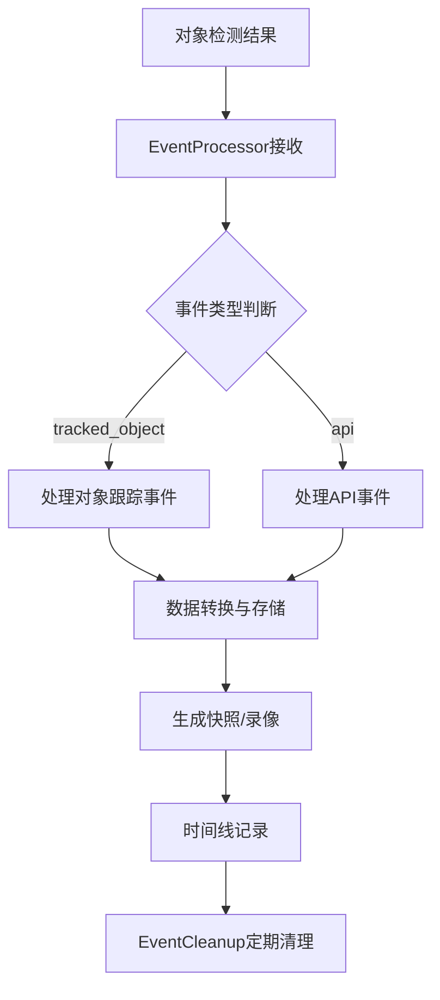

## 在系统中的位置：

- 上游: 接收来自track/object_processing.py的对象跟踪结果

- 下游: 为api/review.py、timeline.py等模块提供事件数据

- 并行: 与录像存储、预览生成等其他模块协同工作

### 1. 事件处理器 (EventProcessor)

- 位置: maintainer.py

- 功能:

- 接收来自对象跟踪器的检测结果

- 处理事件开始、更新、结束生命周期

- 将检测结果转换为数据库中的事件记录

- 生成快照、录像片段等媒体文件

- 管理事件数据的持久化存储

### 2. 音频事件处理器 (AudioProcessor)

- 位置: audio.py

- 功能:

- 处理音频流中的声音检测

- 支持音频转录和语音识别

- 生成音频相关的事件记录

- 与AI模型集成进行音频内容分析

### 3. 事件清理器 (EventCleanup)

- 位置: cleanup.py

- 功能:

- 根据配置的保留策略清理过期事件

- 删除相关的快照、录像和缩略图文件

- 管理存储空间，避免磁盘空间不足

- 支持按摄像头和标签进行差异化清理
  
  
  #后端