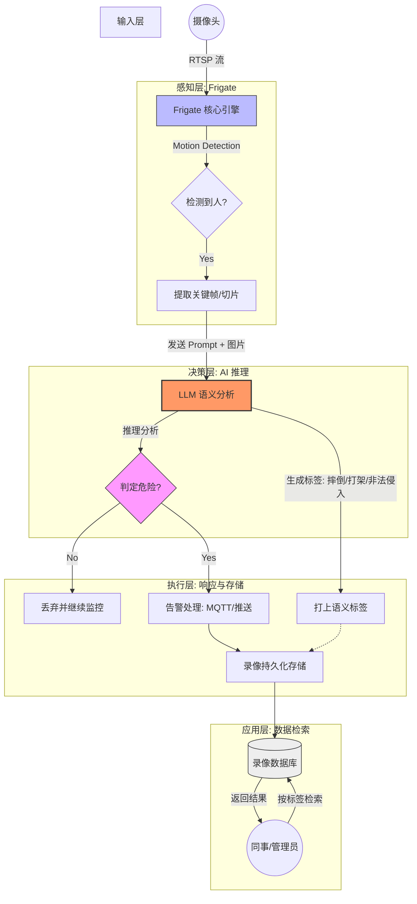

## 1. 核心设计理念：从“视觉识别”到“语义理解”

- **Frigate 原生逻辑**：基于特征的物体识别（Object Detection）。它能告诉你“这里有一个人”，但无法判断“这个人是否在进行危险动作”。
    
- **我们的二次开发 (LLM Powered)**：引入大语言模型（或多模态大模型）的推理能力。它能识别**上下文语义**（Contextual Understanding），例如判断“摔倒”、“持械”或“攀爬”等复杂行为。
    

## 2. 系统数据流程图

我们将 Frigate 作为基础的“感知引擎”，将 LLM 作为“决策大脑”。

## 3. 关键环节说明

### 3.1 帧提取 (Frame Capture)

我们不将整个视频流传给 LLM（成本高且延迟大），而是利用 Frigate 的事件触发机制。当 Frigate 确认“有人”且发生“运动”时，截取关键帧发送给模型。

### 3.2 LLM 判断逻辑 (The "Brain")

- **Prompt 策略**：我们会为模型提供场景描述。例如：“你是一个安全专家，如果图片中有人摔倒或手持锐器，请返回 ALERT，并附带行为描述。”
    
- **非对称风险控制**：通过调整温度值（Temperature）和提示词，我们宁可少量误报，也要确保零漏报（Survival First）。
    

### 3.3 语义标签 (Semantic Tagging)

这是系统最大的价值：

- **传统方式**：你只能按时间找录像，大海捞针。
    
- **新方式**：录像在存储时就带有 `label: "falling_down"` 或 `label: "fighting"`。
    
- **价值**：实现“数据资产化”，方便后期回溯与分析。
    

## 4. 协作开发重点

1. **Frigate 钩子程序**：开发一个 Python 服务，监听 Frigate 的 `events` (MQTT)，一旦有 Event 触发，立即拉取 Snapshot。
    
2. **LLM 接口封装**：建立一个中间层，处理图片压缩、Base64 编码以及与 LLM API 的重试机制（Exponential Backoff）。
    
3. **存储映射**：修改录像保存路径或数据库，将 LLM 返回的 JSON 描述与 Frigate 的 `event_id` 绑定。
    

> 💡 认知驱动执行：
> 
> 我们不是在做一个更强的人形检测器，而是在做一个能“看懂”现场情况的虚拟安保员。